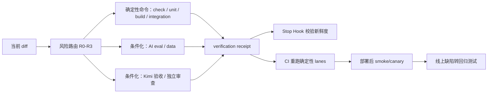

# 适合刘昊的 Vibe Coding 测试体系

## 结论

你的下一阶段重点不是继续增加“审查类型”，而是建立一条统一验收链：

> 变更风险识别 → 确定性测试 → 条件化 Kimi/AI/数据验证 → 独立审查 → 新鲜验收凭证 → Stop Hook → CI → 发布后冒烟 → 缺陷转回归测试

浏览器层当前只保留 Kimi WebBridge。Skill 负责理解和编排；Hook 只检查“验收凭证是否存在且仍对应当前 diff”；脚本负责确定性执行；CI 重跑代码、API、AI 和数据测试。Kimi 负责真实账号、真实浏览器状态下的命名旅程与探索验收。

这不是“所有测试只用 Kimi”：单元、集成、AI eval 和数据测试仍是底座。暂缓脚本化浏览器测试的代价是 CI 不会自动点击页面，因此 UI 变更必须依赖本地 Kimi 证据和新鲜 receipt；等关键旅程稳定、重复频率足够高时，再单独评估是否值得引入浏览器脚本。

## 本地历史给出的证据

分析覆盖本机 2026-03-27 至 2026-07-17 的 694 个 Codex 任务，其中 545 个主任务、144 条父子任务关系，流式扫描约 2.51GB rollout 数据。统计只提取事件和模式，不复述会话原文。

- 任务高度集中在 AI 工作流（349 个主任务）、自动化/知识管理（172）、产品 UI（167）、测试/审查（165）、后端/数据（154）和 Bug 修复（151）。因此普通“单元测试 + E2E”少了 AI 语义与数据真实性这一层。
- 全历史 273 个发生代码修改的开发型任务组中，231 个出现过某种验证；138 个有测试，20 个有真实浏览器，27 个有对抗审查，只有 7 个同时具备测试、真实浏览器和对抗审查。
- 最近 30 天 55 个发生修改的开发型任务组中，35 个有某种验证；16 个有确定性测试，17 个有项目级 check/verify，13 个有真实浏览器，16 个有对抗审查，7 个三层齐全。浏览器和对抗审查明显增强，但确定性底座没有同步提升。
- 545 个主任务中有 238 个出现过“仍然有问题/没生效/重新修”等修正信号。这是宽口径代理指标，包含需求迭代，不等同于 238 个缺陷；它仍说明完成标准经常依赖用户继续发现问题。
- 历史前 20 个高频项目路径中，当前仍存在 14 个：10 个已有测试文件，只有 4 个暴露统一 `test` 脚本，7 个有某类 `check/verify/smoke`，4 个有 `build`，4 个有 `AGENTS.md` 验证规则；1 个安装了 Playwright 依赖，但 0 个存在 Playwright 配置，0 个存在 GitHub Actions 工作流。
- 当前全局配置有 turn-ended 通知，但没有已配置的 Codex lifecycle Hook。通知只告诉你任务结束，不检查任务是否完成。

这些数据共同指向一个问题：能力并不少，缺的是统一入口、风险路由、证据格式和机械完成门槛。

## 体系结构

### 职责边界

| 载体 | 负责什么 | 不负责什么 |
|---|---|---|
| `AGENTS.md` | 项目命令、Done 标准、数据和密钥约束 | 动态判断本次 diff 风险 |
| `verify-change` Skill | 读策略、编排浏览器和审查、生成证据 | 充当最终真相源 |
| `verification-policy.json` | 路径到风险和 lane 的确定映射 | 执行测试 |
| `verify-change.ps1` | 执行命令、校验证据、生成带 diff 指纹的 receipt | AI 自由判断 |
| Stop Hook | 有修改时检查 receipt 是否新鲜 | 在 Hook 内跑全套测试 |
| Kimi WebBridge | 真实登录态下的命名旅程、视觉、network 和探索性验收 | 替代单元/API/数据回归 |
| 独立审查 | 发现跨模块、边界和系统性风险 | 替代实际执行结果 |
| CI | 重跑确定性 lanes，决定 PR 是否可合并 | 依赖本地“我跑过了”的口头结论 |

## 风险路由

| 风险 | 典型变更 | 默认要求 |
|---|---|---|
| R0 | 文档、纯文案 | diff check |
| R1 | 小范围行为、局部 Bug | static + unit |
| R2 | UI、API、AI 行为 | R1 + build + 对应的 integration / Kimi / AI eval |
| R3 | auth、权限、积分、迁移、队列、重试、部署 | R2 + data/smoke + 独立审查；用户旅程相关时加真实浏览器 |

不要每次都跑所有测试。风险路由的价值是：低风险改动保持快，高风险改动自动加码，而且完成标准稳定。

## 六层测试栈

### 1. 静态与局部回归

目标是 1–2 分钟内发现语法、类型、lint、直接行为回归。每个真实项目至少暴露一个统一 `check` 和一个 `test` 入口。

### 2. 集成与状态

覆盖 API 契约、临时数据库、迁移/回滚、约束、并发写入、外部适配器错误。对导入、队列、生成任务重点测：重复消息、重试、取消、超时、部分成功和幂等。

### 3. AI 与数据语义 Eval

这是最适合你、也最容易被普通测试漏掉的一层。每个核心 AI 能力维护 20–50 条小型 golden cases，先跑规则断言，再跑模型 rubric：

- 输出 schema 和字段完整性；
- 结论能否追溯到输入字段或来源；
- 缺数据时明确标缺，而非补造事实；
- 禁止承诺、越权建议和业务红线；
- 同义输入或顺序变化后的关键结论稳定性；
- 超时、token、成本和大输入预算。

模型评分只用于规则难表达的质量维度，不作为唯一门槛。原始数据、规则计算和模型推断要在测试报告里分开。

### 4. Kimi 核心旅程验收

每个长期项目先维护 5–10 条有名字、可重复执行的 Kimi 旅程，不追求页面穷举：

1. 登录/鉴权与失效恢复；
2. 上传或导入，含错误格式和大文件；
3. AI 任务启动、loading、取消、重试和错误反馈；
4. 结果保存、刷新、历史恢复和跨页面一致性；
5. 权限、积分或高价值业务动作。

每次只执行受 diff 影响的旅程，并把步骤、预期、实际、关键截图和失败请求写入 `artifacts/verification/kimi-browser-qa.md`。这份文件是当前 diff 的验收证据，不是口头的“点过了”。

### 5. Kimi 探索扩边与回归沉淀

只在 UI/真实账号/线上状态相关的 R2-R3 变更触发。在核心旅程之外，根据改动风险加测：刷新/返回、重复提交、空数据、错误输入、超时/失败恢复、权限或积分边界。固定使用一个 Kimi session，操作前开启 network 捕获，优先用语义快照定位元素。

Kimi 发现的稳定缺陷按根因沉淀：业务逻辑优先转成 unit/API/domain/data 回归；真正只存在于交互和视觉层的问题，写成一条命名 Kimi case，后续相关 UI 变更重复执行。

### 6. 对抗审查与生产验证

日常不需要 40 个 Agent。R3 或 AI 核心链路用 3–5 个新上下文角色足够：数据真实性、可靠性/资源压力、安全隔离、UX 恢复、必要时性能。发现必须包含证据、复现、影响路径、严重性和建议回归测试；修复者与复核者分离。

部署后只做少量真实 smoke/canary：health、核心读路径、核心写路径、任务队列、关键第三方。记录版本、时间和回滚入口。

## 对你现有项目的迁移顺序

### 第一批：`chaoxing` + `comment-ai`

- `chaoxing` 已有约 56 个测试文件和 `verify/lint/typecheck/test/build`，适合先验证风险路由、receipt、Hook 和 CI。
- `comment-ai` 已有规则检查、历史回放、backtest 和 smoke，但缺少统一单元测试。它能验证 AI/data lane 是否真正有用，而不是只服务传统 Web 项目。

### 第二批：`RedSpark` + `redbase-fullstack-latest`

- `RedSpark` 接入现有 `check/test/typecheck/build`，再补关键 Kimi 旅程。
- `redbase-fullstack-latest` 接入 `check/test/smoke:api`，优先补 auth、积分、生成任务和历史恢复的 Kimi 验收 case。

### 暂缓

历史里有多个已失效路径和项目副本。先在两个项目跑稳两周，再抽成个人 plugin 或同步脚本；一开始直接全局强制会让知识管理任务、旧 demo 和一次性脚本一起承受维护成本。

## 三阶段落地

### 第 1 周：建立统一凭证

1. 先在一个试点项目复制 policy 和 runner；Hook 暂不启用。
2. 将现有命令映射到 lane；缺失的 required lane 显式失败。
3. 把测试产物目录加入 `.gitignore`。
4. 先启用 `-PlanOnly` 和手工 `$verify-change`，观察 2–3 天。
5. 连续 2–3 天没有误拦截后，再复制并信任项目 Hook；CI 最后启用。

### 第 2 周：补最值钱的回归

- 每个项目补 5 条命名 Kimi 关键旅程。
- 每个 AI 核心能力补 20 条 golden cases。
- 把过去高频返工的 auth、导入、AI loading/error、历史恢复、积分/权限写成回归测试。

### 第 3–4 周：让 CI 成为合并门槛

- CI 重跑所有确定性 lane。
- R3 本地 receipt 额外要求浏览器和独立审查证据。
- 测试量和频率上升后再评估 self-hosted runner；当前先用托管 runner，避免环境漂移和维护负担。

## 应跟踪的指标

- Fresh receipt coverage：有代码修改的开发任务中，新鲜 receipt 覆盖率；两周目标 90%，四周 95%。
- Routed deterministic coverage：R1+ 任务确定性 lane 完成率；当前近 30 天约 29%，目标 90%+。
- UI route browser coverage：只对被路由为 UI R2/R3 的任务要求 100%，不对所有任务要求浏览器。
- R3 adversarial coverage：R3 任务 100%，R0/R1 默认 0%。
- Kimi bug → regression conversion：稳定缺陷 100% 转 unit/API/domain/data 测试或命名 Kimi case。
- Flaky rate：低于 2%；超过后先治理 flaky，再扩测试量。
- Verification p50/p95：低风险目标 2/5 分钟，高风险目标 10/20 分钟。

不要用测试总数作为主指标。真正应提升的是：按风险命中正确 lane、凭证新鲜、缺陷变回归、用户不再重复发现同一类问题。

## 模板文件

- `verification-policy.json`：风险与 lane 路由。
- `scripts/verify-change.ps1`：唯一确定性执行入口。
- `.codex/hooks.json`：PostToolUse dirty 标记与 Stop gate。
- `.github/workflows/ci.yml`：Windows CI 示例。
- `skills/verify-change/`：可安装的编排 Skill。
- `AGENTS.testing-snippet.md`：项目规则片段。
- `evidence.example.json`：浏览器和独立审查证据格式。
- `START-HERE.md`：第一次接入与每天怎么调用。
- `templates/kimi-browser-qa.md`：Kimi 浏览器验收记录模板。

首次接入时先按项目实际命令修改 policy。模板故意让缺少 required command 的 lane 失败，以暴露真实缺口，而不是用 `--if-present` 伪装通过。
